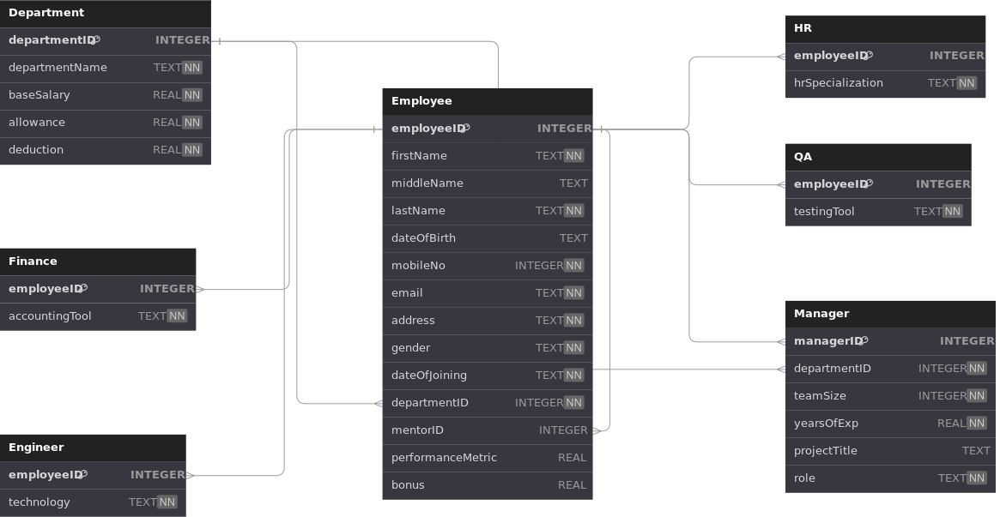
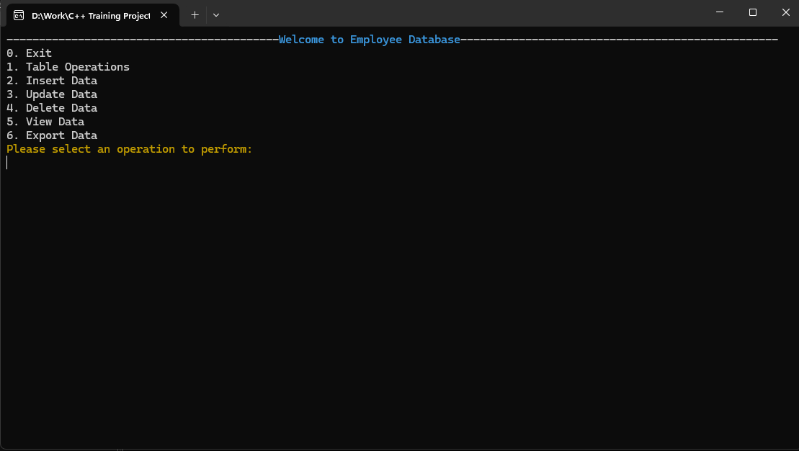
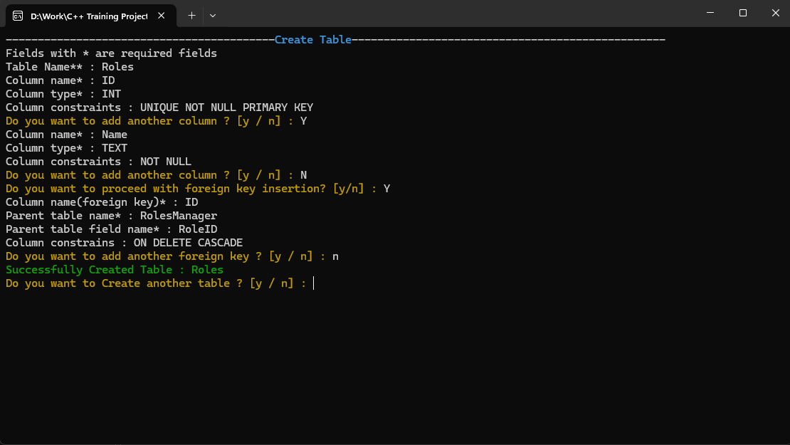
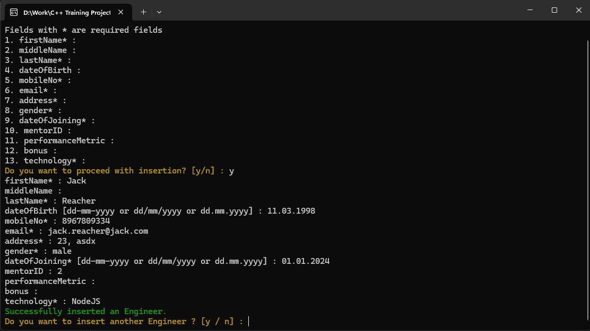
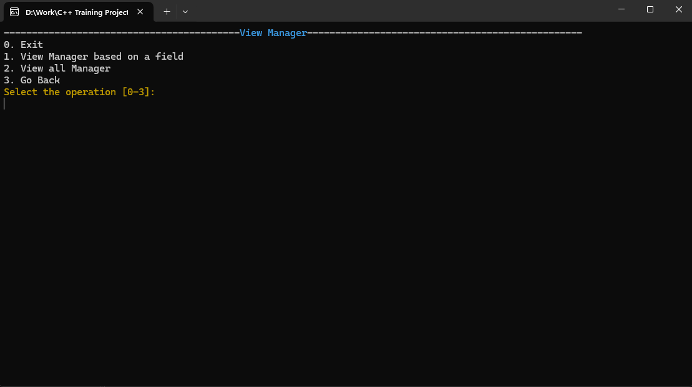
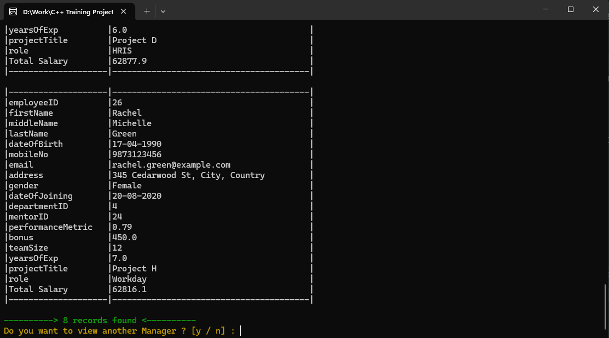
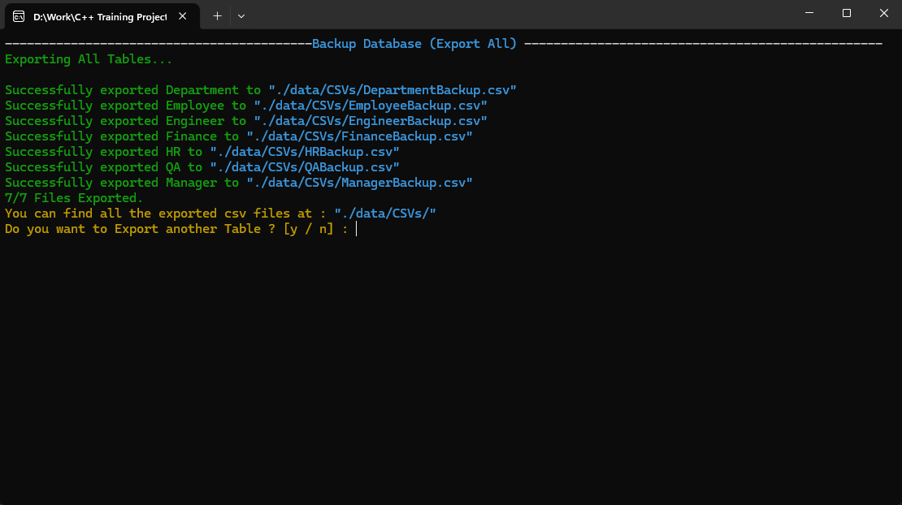

# EmployeeVault

#### EmployeeVault is Console Application which provides interface to interact with Employee Database.

# Tech Stack

`C++17` for whole project.

[Sqlite3](https://www.sqlite.org/) as the database.

[LogPulse(Own custom library)](https://github.com/Rushi1109/LogPulse) for dumping logs.

[gTest/gMock](https://google.github.io/googletest/) for Unit Testing.

# Installation on Local Machine
1. Install [Visual Studio](https://visualstudio.microsoft.com/downloads/) and Configure C++ Development Environment.

2. Clone this repository.

3. Double Click on `install_sqlite.bat` file or run it via terminal to download sqlite3.

4. Open the solution in Visual Studio.

5. Build and run.

# Database schema

# Functionalities 

- User can Create Tables in the Database with primary and foreign keys constraints.

- User can delete the Table.

- User can Insert, Update, Delete, View data in Department, Engineer, Finance, HR, QA, Manager Tables.

- User can also Export the table data.

- User can Backup whole database in different CSVs.

# Demo

